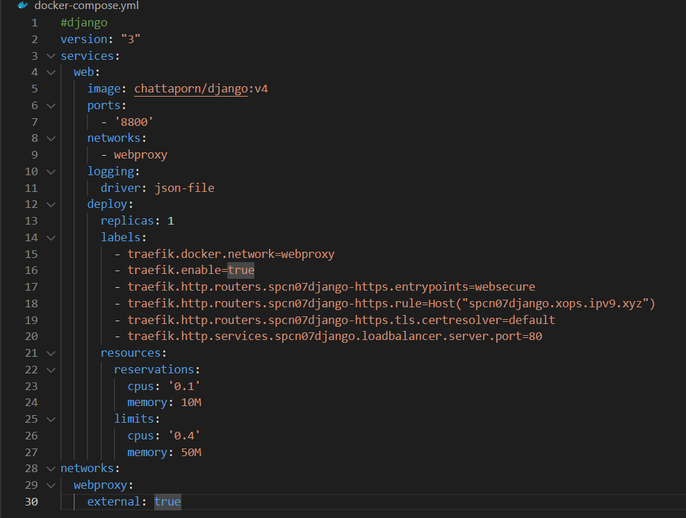

# swarm02 django
Ref. awaresome-compose
    
- https://github.com/docker/awesome-compose/tree/master/django

Wakatime project
- https://wakatime.com/@spcn07/projects/yajbpohslz?start=2023-02-27&end=2023-03-05

Url django
- https://spcn07django.xops.ipv9.xyz/

## ขั้นตอนการสร้าง
 - [1.Create django](#1create-django)
 - [2.Images On Dockerfile](#2build-images-on-dockerfile)
 - [3.แก้ไขข้อมูลไฟล์](#3แก้ไขข้อมูลไฟล์)
 - [4.deploy stack](#4-deploy-stack)
 - [5.เช็คการเข้าใช้งาน Url.](#5เช็คการเข้าใช้งาน-url)

 # **1.Create django**
- ทำการ Clone github จาก Ref.
    * https://github.com/docker/awesome-compose/tree/master/django

    

- ทำการแก้ไขข้อมูลไฟล์ compose.yaml
    * แก้ไขเลข port จาก 8000 : 8000 เป็น 
   8800 : 8000 
  

# **2.build Images On Dockerfile**
    * โดยการเข้าที่ Docker hub -> Create repository -> ตั้ง Name =  django

    

 * copy path : chattaporn/django
โดยใช้คำสั่ง
     
        docker build . -t chattaporn/django:v4

 * push ขึ้น Dockerhub
    * ใช้คำสั่ง docker login เพื่อเข้าสู่ระบบก่อน
    * ใช้คำสั่ง docker push chattaporn/django:v4

 * ผลลัพธ์

    

# **3.แก้ไขข้อมูลไฟล์**

- ทำการอนุญาติการเข้าถึงด้วย IP อื่น
  * แก้ไขที่ไฟล์ settings.py 

    

- แก้ไขข้อมูล docker-compose.yaml

    

# **4.deploy stack**

    * https://portainer.ipv9.me/

โดยทำการ กด Aff Stack -> ตั้งชื่อ django-spcn07 -> วางโค้ด docker- compose.yaml ที่ wab editor -> Deploy the stack

 
 - ผลลัพธ์จากการ deploy stack

# **5.เช็คการเข้าใช้งาน Url.**

- เช็คว่า Url เข้าใช้งานได้จริงมั้ย แสดงผลจริงมั้ย
    * https://spcn07django.xops.ipv9.xyz/

ผลลัพธ์

Ref.ทั้งหมด
    
* https://github.com/pitimon/dockerswarm-inhoure
    
* https://youtu.be/UGEs5P5pKZ8
    
 * https://github.com/docker/awesome-compose/tree/master/django